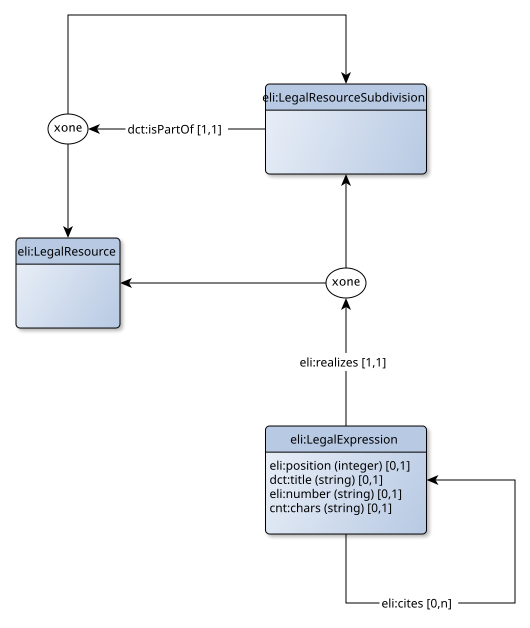

# Voorbeeld - Participatiewet

## Inleiding en doel

Deze map bevat een volledige uitwerking van de kennisgraaf voor de participatiewet. Het beoogde doel is dat hiermee een volledige kennisgraaf tot stand wordt gebracht, met alle mogelijke verbanden die nodig zijn voor een volledige visualisatie.

De uitwerking is gedaan in RDF. Anders dan meestal gebruikelijk, is daarbij ook de *content* van de regelgeving zelf opgenomen in RDF (dus niet alleen de metadata). Het is hiermee mogelijk om de volledige tekst van de regeling te reconstrueren vanuit de kennisgraaf.

## Huidige status

Op dit moment is de uitwerking beperkt tot de tekst van de participatiewet zelf en de verwijzingen die expliciet in de tekst zelf aanwezig zijn. Dit houdt in dat nog niet is opgenomen:

- De meest metadata zoals die op wetten.overheid.nl te vinden is.
- Alleen de meest recente versie van de participatiewet is beschikbaar.
- Alleen de verwijzingen binnen de participatiewet *resolven*, dwz: leiden tot het vinden van de juiste tekst. De verwijzingen naar andere bronnen zijn wel aanwezig, maar leiden niet naar tekst binnen de kennisgraaf, immers: slechts de participatiewet is ingeladen.
- Omdat ook onderliggende regelgeving niet is ingeladen, zijn verwijzingen "terug" (vanuit die regelgeving naar de participatiewet) in het geheel niet aanwezig. Ook lokale regelgeving is nog niet opgenomen.
- Jurisprudentie, beleidsregels en interpretatiebronnen zoals memorie van toelichting en commentaren zijn nog niet ogpenomen.

Uiteindelijk is het de bedoeling dat de kennisgraaf ook wordt aangevuld met analyse- en interpretatieresultaten. Ook deze zijn nog niet opgenomen, zoals:

- Grammaticale duiding van de zinsdelen binnen een tekstfragment is niet beschikbaar, zoals onderkennen van normexpressies, het subject en object van een norm, etc.
- Semantische verbanden (zoals bv welke tekstfragmenten gaan over een bepaald begrip) ontbreken, aangezien de gehele semantische laag nog niet is ogpenomen.

## Uitleg van het model

Onderstaand figuur geeft het model van de huidige kennisgraaf weer. Dit model is de grafische weergave van de shapes graph, zie [model.ttl](model.ttl) voor de machine-leesbare download.

De kennisgraaf volgt de FRBR onderverdeling zoals die in de ELI vocabulaire wordt gehanteerd, van "LegelResource" (een werk zoals de participatiewet) en "LegalExpression" (versies van die participatiewet). Hiermee kan op termijn ook versiebeheer worden ondersteund. Daarnaast is een "LegalResource" opgedeeld in "LegalResourceSubdivision" (tekstfragmenten van de wet, zoals een hoofdstuk, artikel of lid).

Een tekstfragment is onderdeel van een ander tekstfragment of van het volledig werk (in dit geval dus de participatiewet). Elk tekstfragment kent in de huidige kennisgraaf precies één expressie die de feitelijke inhoud ("chars") van dat tekstfragment bevat. Dit kan een titel zijn (zoals bij een hoofdstuk of artikel), een nummer (zoals bij lid of onderdeel), maar ook daadwerkelijk inhoud (de aanhef van een artikel, de tekst van een lid of de tekst van een artikel zonder leden). Om de volgorde van de onderdelen te kunnen reconstrueren, bevat de expressie ook de relatieve positie van die expressie in de tekst.

Tenslotte kan in een expressie verwezen worden ("cites") naar een ander tekstfragment. Interne verwijzingen verwijzen daarbij altijd naar een andere expressie, externe verwijzingen verwijzen naar een tekstfragment ("LegelResourceSubdivision") of een volledig werk ("LegelResource").

## Volledige model

Het volledige model is te download in de volgende formaten:
- Als RDF/XML bestand: [BWBR0015703.rdf](BWBR0015703.rdf)
- Als Turtle bestand: [BWBR0015703.ttl](BWBR0015703.ttl)
- Als JSON-LD bestand: [BWBR0015703.json](BWBR0015703.json)

het betreft exact dezelfde informatie, alleen anders geserialiseerd.
